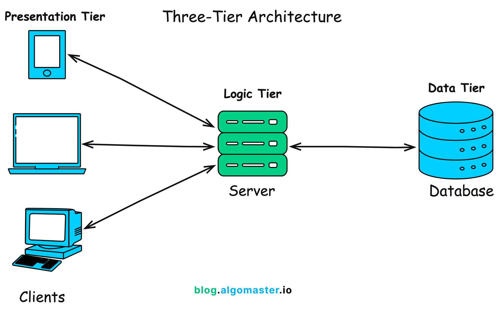
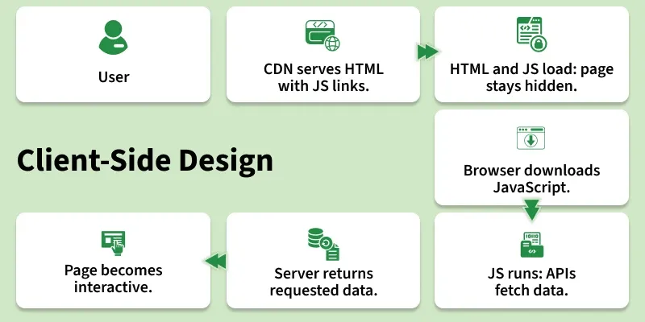
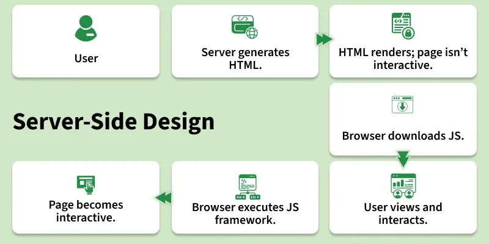

## Développement Back-end (Flask)

#### Badmavasan KIROUCHENASSAMY

##### 2 Février 2026 | Nexa Paris
##### Objectif 
- comprendre *qui fait quoi* dans une application web
- construire vos premiers endpoints Flask (HTML + API)

---

## Icebreaker 
### “Qui fait quoi ? Front ou Back ?”

Je vous montre des scénarios ✅  
Vous votez : **Frontend**, **Backend**, ou **les deux**.

> Règle : pas de débat long, réponse rapide + justification en 1 phrase.

---

## Scénario 1
### “Quand je clique sur ‘Se connecter’”

- Le bouton devient “chargement…”
- Une requête part au serveur
- Le serveur vérifie le mot de passe
- La page affiche “Bonjour, Lina”

**Front ? Back ? Les deux ?**

---

## Scénario 2
### “Ajouter un produit au panier”

- Le compteur du panier passe de 1 à 2
- Le serveur enregistre le panier
- Une réduction est appliquée si > 100€

**Front ? Back ? Les deux ?**

---


## Scénario 3
### “Un paiement est refusé”

- Message rouge : “Paiement refusé”
- Journal serveur : “Carte expirée”
- Le serveur bloque 5 tentatives de suite

**Front ? Back ? Les deux ?**

---

## Scénario 4
### “Optimiser les performances”

- Images chargées en plus petit format
- Mise en cache des résultats “produits populaires”
- Compression des réponses HTTP

**Front ? Back ? Les deux ?**

---


## Débrief rapide
### Ce qu’on observe

- **Frontend** : ce que l’utilisateur *voit* et *manipule*
- **Backend** : règles métier + données + sécurité + intégrations
- **Les deux** : performance, validation, expérience utilisateur

---

## Définition : Frontend
### Côté utilisateur

Le **frontend** est la partie :
- affichée dans le navigateur / mobile
- responsable de l’interface (UI)
- qui déclenche des actions (clics, formulaires)
- qui appelle souvent un backend

---

## Définition : Backend
### Côté serveur

Le **backend** est la partie :
- qui reçoit les requêtes (HTTP)
- applique des règles métier
- valide, sécurise, autorise
- lit/écrit les données (BD)
- renvoie une réponse (HTML/JSON)

---

## Différence clé
### Qui “rend” l’interface ?

- **Frontend** : *rend* l’UI (affiche)
- **Backend** : *décide* et *fournit* (données / pages)

> Front = expérience & interaction  
> Back = logique & fiabilité

---

## Exemple concret
### Recherche “pizza”

- Frontend : champ de recherche + affichage résultats
- Backend : recherche en base + tri + règles + réponse

Même fonctionnalité, responsabilités différentes.

---


## Séparation Front / Back
### Pourquoi c’est une bonne idée ?

- **Clarté** : chacun son rôle
- **Évolutivité** : on change l’UI sans casser la logique
- **Réutilisation** : un backend pour web + mobile
- **Sécurité** : les règles restent au serveur
- **Travail en équipe** : front et back en parallèle

---

## Attention : où mettre les règles ?
### Règle d’or

- Le front peut *aider* (UX), mais **le back doit imposer**
- Exemple : “âge ≥ 18”  
  - Front : **message instantané**   
  - Back : **vérification obligatoire**

---


## Le “mindset” backend (1/2)
### Votre rôle principal

Vous construisez :
- des **contrats** (endpoints, formats JSON, codes HTTP)
- un système **robuste** (validation, erreurs, sécurité)
- une logique **cohérente** (règles métier, invariants)

---


## Le “mindset” backend (2/2)
### Penser “système”, pas “écran”

Questions réflexes :
- Et si l’utilisateur triche ?
- Et si la donnée est incomplète ?
- Et si 1 000 requêtes arrivent d’un coup ?
- Et si le service externe tombe ?

---

## Ce qu’on attend d’un backend “pro”
- Réponses **prévisibles** (status codes)
- Erreurs **claires** (messages + structure)
- Données **propres** (validation)
- Sécurité **par défaut** (ne jamais faire confiance aux saisies de l'utilisateur)

---

## Mini-activité (2 min)
### “Quand je clique Login, que se passe-t-il ?”

En Binôme : listez 6–8 étapes
- côté navigateur
- côté serveur
- entre les deux (HTTP)

---

## Architecture d’un client web



---

## Architecture d’un client web (vue Client)



---

## Architecture d’un client web (vue Server)



---

## Architecture d’un client web

- Le **navigateur** affiche l’interface et envoie des requêtes
- Le **backend** répond avec **HTML** ou **JSON**
- Les fichiers statiques peuvent venir du backend ou d’un **CDN**

---

## Question clé
### 2 manières courantes de faire du backend

- **SSR** : le serveur renvoie du **HTML**
- **API** : le serveur renvoie du **JSON**

Différence principale : **qui construit l’interface ?**

---


## Type A — SSR (Server-Side Rendering)
### Le backend renvoie du HTML

- Le serveur **génère** la page (HTML)
- Le navigateur **affiche** la page

Exemples :
- Blog, site vitrine, back-office simple
- Pages “classiques” avec formulaires

---


## SSR : comment ça marche ?
### Schéma

```
[Navigateur]
|
| GET /produits
v
[Backend (Flask)]
|
| génère HTML (template)
v
[Réponse HTML]
|
v
[Navigateur affiche la page]
```

---

## SSR : avantages / limites

#### Avantages
- Déploiement souvent plus simple
- Moins de “couches” techniques

#### Limites
- UI complexe = plus dur à maintenir
- Interactivité riche → besoin de JS

---


## Type B — API (JSON)
### Le backend renvoie des données

- Le serveur renvoie **JSON**
- Le frontend (web/mobile) **rend l’UI**

Exemples :
- SPA React/Vue, app mobile
- Plusieurs clients (web + mobile)

---


## API : comment ça marche ?
### Schéma

```
[Frontend Web / Mobile]
|
| GET /api/produits
v
[Backend (Flask)]
|
| renvoie JSON
v
[Réponse JSON]
|
v
[Frontend affiche l’UI]
```

---

## API : avantages / limites
#### Avantages
- Séparation claire (front / back)
- Plusieurs clients avec la même API
- Contrat stable (endpoints + JSON)

#### Limites
- CORS à gérer (web)
- Auth souvent par tokens
- Versioning / coordination front-back

---

## Comparaison rapide
### Qui fait quoi ?

- **SSR** : Backend = pages HTML, Frontend = affichage + un peu de JS
- **API** : Backend = données + règles, Frontend = UI complète

---

## Conclusion
### Choisir selon le besoin

- Besoin simple + pages : **SSR**
- UI riche + multi-clients : **API**

**Avec Flask**, on peut faire **les deux**.

---


## On commence par le SSR (HTML)

---

## Pourquoi commencer par SSR ?
- On voit **tout le cycle** : requête → route → template → HTML
- Plus concret pour comprendre :
  - formulaires
  - redirections
  - validation côté serveur
- Ensuite, passer à JSON devient naturel

---

## Objectifs 
À la fin, vous saurez :
- créer un projet Flask
- définir des **routes**
- comprendre **route vs handler**
- renvoyer : texte / HTML / template
- gérer GET vs POST (formulaires)
- organiser un mini-projet SSR

---


# 1) Préparer l’environnement

---

## Pré-requis
- Python installé (idéalement 3.10+)
- Un terminal
- Un éditeur (VS Code, PyCharm, etc.)

---


## Créer le projet + environnement virtuel (1/2)
Dans un dossier vide :

```bash
mkdir bookshelf
cd bookshelf
python -m venv .venv
```

**venv** : A Python virtual environment (venv) is simply a directory with a particular file structure

**Objectif** : isoler les dépendances du projet.

---
## Créer le projet + environnement virtuel (2/2)

#### Activer l’environnement virtuel

- macOS / Linux :

```bash
source .venv/bin/activate
```

- Windows (PowerShell) :

```bash
.venv\Scripts\Activate.ps1
```

**Vous devez voir (`.venv`) dans le terminal.**

---

## Installer Flask

```bash
pip install flask
```

Vérifier :

```bash
python -c "import flask; print(flask.__version__)"
```

---

## Structure de départ (SSR)

On commence simple : 

```bash
bookshelf/
  app.py
  templates/
    base.html
    index.html
    new_book.html
  static/
    style.css
```

---

## 2) Flask : routes & handlers

---

## C’est quoi Flask ?

Flask est un framework web Python qui :
- écoute des requêtes HTTP
- associe une URL à une fonction Python
- renvoie une réponse (HTML / JSON / etc.)

---

## Route : “à quelle adresse on répond ?”

Une route décrit :
- une URL (ex: /)
- et souvent une méthode HTTP (ex: GET)

**Exemple :**
`GET` / veut dire “je veux la page d’accueil”.

---

## Handler : “quel code s’exécute ?”

Le handler est la fonction Python appelée quand une route correspond.

Donc :
- Route = “quand on reçoit GET /”
- Handler = “on exécute cette fonction”

---

## Exemple SSR minimal

Créer `app.py` :

```python
from flask import Flask

app = Flask(__name__)

@app.get("/")
def home():
    return "<h1>Bonjour SSR !</h1>"
```

Ici :
- `@app.get("/")` = la route
- `home()` = le handler
- la string retournée = la réponse HTML

---

## Lancer le serveur en mode développement

```
flask --app app run --debug
```

Ouvrir : `http://127.0.0.1:5000/`

1. Le navigateur fait une requête GET /
2. Flask exécute home()
3. et renvoie le HTML.

---

## Port du serveur : configurable
Par défaut, Flask démarre sur **5000**.

Il est possible changer le port :

```bash
flask --app app run --debug --port 8000
```

Puis ouvrir : `http://127.0.0.1:8000/`

---

## Configurer le port dans le code

Il est possible lancer Flask directement via Python et choisir le port :

```python
from flask import Flask

app = Flask(__name__)

@app.get("/")
def home():
    return "Hello"

if __name__ == "__main__":
    app.run(debug=True, host="127.0.0.1", port=8000)
```

- `host` : où le serveur écoute (localhost ici)
- `port` : le port utilisé (ici 8000)
- `debug` : mode développement

---

## Pourquoi un fichier .env ?

Un fichier `.env` sert à stocker la configuration hors du code :

- port, mode debug
- clés secrètes (sessions)
- URL de base de données
- tokens d’API (services externes)

**Avantage** : on ne modifie pas le code selon la machine / l’environnement.

Installation :

```bash
pip install python-dotenv
```

---

## Exemple de fichier .env

À la racine du projet (`bookshelf/.env`) :

```
FLASK_DEBUG=1
FLASK_PORT=8000
SECRET_KEY=change-moi
DATABASE_URL=sqlite:///app.db
```

**/!\ Ne mettez pas ce fichier dans Git !**

---

## Lire le .env dans app.py

Exemple complet :

```python
import os
from dotenv import load_dotenv
from flask import Flask
load_dotenv()  # charge les variables du fichier .env dans l'environnement
app = Flask(__name__)
# Lire les variables
DEBUG = os.getenv("FLASK_DEBUG", "0") == "1"
PORT = int(os.getenv("FLASK_PORT", "5000"))
SECRET_KEY = os.getenv("SECRET_KEY", "dev-secret")
# Appliquer au projet
app.config["SECRET_KEY"] = SECRET_KEY
@app.get("/")
def home():
    return f"Debug={DEBUG}, port={PORT}"
if __name__ == "__main__":
    app.run(host="127.0.0.1", port=PORT, debug=DEBUG)
```

---

## Ce qui se passe ici (très concret)

- `load_dotenv()` lit `.env`
- `os.getenv("NOM")` récupère la valeur
- On convertit les types :
    - `"8000"` → `int(...)`
    - `"1"` → booléen avec une comparaison

---

## Ajouter une autre route (exemple)

```python
@app.get("/about")
def about():
    return "<p>Page à propos</p>"
```

Test :
 - `/` → “Bonjour SSR”
- `/about` → “Page à propos”

**Deux “adresses” crée côté serveur.**

---

## Méthode HTTP : pourquoi GET vs POST ?

`GET` : “je veux lire / afficher”

`POST` : “j’envoie des données” (souvent un formulaire)

Même `URL` possible, mais pas la même intention.

---


## Comment les données sont envoyées en HTTP ?
Il y a **3 endroits classiques** où une appli web envoie des données :

1) **Dans l’URL (chemin)** : pour identifier une ressource  
2) **Dans l’URL (query string)** : pour filtrer / chercher / paginer  
3) **Dans le corps (body)** : pour créer / envoyer un formulaire / JSON

On va voir un exemple de chaque.

---

## 1) Données dans le chemin (path)
**Quand ?** Pour “pointer” une ressource précise.

Exemple :
- `/books/12`

Ici `12` est l’identifiant du livre.  

C’est une info “structurelle” : *quelle ressource ?*

```python
@app.get("/books/<int:book_id>")
def detail(book_id):
    return f"Détail du livre {book_id}"
```

---

### 2) Données dans la query string (?)

**Quand ?** Pour modifier une lecture : filtrer, trier, rechercher, paginer.

Exemples :
- `/books?author=asimov`
- `/books?sort=title`
- `/books?page=2&limit=20`

C’est une info “optionnelle” : comment lire ?

```python
from flask import request

@app.get("/books")
def list_books():
    author = request.args.get("author")
    return f"Filtre auteur = {author}"
```

---

### 3) Données dans le body (formulaire / JSON)

**Quand ?** Quand on envoie des données “riches” : créer, modifier, login…

Exemples :
- Formulaire HTML (SSR) → request.form
- JSON (API) → request.get_json()

**C’est une info “contenu” : quoi envoyer ?**

```python
from flask import request

@app.post("/books")
def create_book():
    title = request.form.get("title")
    author = request.form.get("author")
    return f"Créé: {title} - {author}"
```

---

## Quel format utiliser ? (règles simples)

- Path : identifier la ressource
`/books/12`

- Query : paramètres de lecture (filtre, tri, page)
`/books?author=...&page=...`

- Body : création / modification / login
`POST avec formulaire ou JSON`

---

## GET vs POST : dans quel cas utiliser ?

#### GET
- lire / afficher une page
- récupérer une liste
- faire une recherche
- doit être “safe” : ne pas créer/modifier

#### POST

- envoyer un formulaire
- créer une ressource
- déclencher une action (ex: login)

---

## SSR : templates (HTML propre)

### Pourquoi des templates ?

Retourner du HTML en string fonctionne, mais devient vite illisible.

Un template permet :
- d’écrire du HTML “normal”
- puis d’y insérer des données Python proprement

---

## Premier template

Créer `templates/index.html` :

```html
<!doctype html>
<html>
  <body>
    <h1>Bienvenue sur BookShelf</h1>
  </body>
</html>
```

---

## Rendre un template depuis un handler

Dans `app.py` :

```python
from flask import render_template

@app.get("/")
def home():
    return render_template("index.html")
```

Ici, Flask lit le fichier HTML et le renvoie au navigateur.

---

## Exemple : injecter une variable

`app.py` :

```python
@app.get("/")
def home():
    return render_template("index.html", username="Lina")
```

`index.html` :

```html
<h1>Bienvenue {{ username }}</h1>
```

---

## Exemple : afficher une liste

`app.py` :

```python 
@app.get("/")
def home():
    books = ["Dune", "Clean Code", "1984"]
    return render_template("index.html", books=books)
```

`index.html` :

```html
<ul>
  
    <li>{{ b }}</li>
  
</ul>
```

---

## Template du formulaire (1/2)

Créer `templates/new_book.html` :

```html
<!doctype html>
<html>
  <body>
    <h2>Ajouter un livre</h2>
    <form method="post">
      <input name="title" placeholder="Titre" />
      <input name="author" placeholder="Auteur" />
      <button type="submit">Enregistrer</button>
    </form>
  </body>
</html>
```

---

## Template du formulaire (2/2)

```python
from flask import request, render_template, redirect, url_for
@app.route("/books/new", methods=["GET", "POST"])
def new_book():
    global NEXT_ID
    if request.method == "GET":
        return render_template("new_book.html")
    title = request.form.get("title", "").strip()
    author = request.form.get("author", "").strip()
    BOOKS.append({"id": NEXT_ID, "title": title, "author": author})
    NEXT_ID += 1
    return redirect(url_for("home"))
```

Dans cet exemple le SSR :
- `GET` affiche une page
- `POST` traite puis redirige

---

## Validation : ne pas faire confiance au client

Même si le navigateur “a l’air” correct, le serveur doit vérifier.

Exemple :

```python
if not title or not author:
    return "Champs manquants", 400
```

**Le backend protège la logique.**

---

# Sessions en Flask (SSR)
## Comment le serveur “se souvient” de vous ?

En SSR, on renvoie du HTML différent selon l’utilisateur.  
Pour ça, on utilise souvent une **session**.

---

## Le problème à résoudre
HTTP est **sans mémoire** (stateless) :

- Requête 1 : le serveur ne “connaît” pas encore l’utilisateur
- Requête 2 : le serveur ne se souvient pas automatiquement de la requête 1

Une session sert à garder un **contexte** (ex: utilisateur connecté).

---

## Cookie vs Session (idée simple)
- **Cookie** : petit morceau de données stocké dans le navigateur
- **Session** : “mémoire” côté serveur (ou logique de mémoire) liée à un utilisateur

En pratique :
- le navigateur envoie un **cookie**
- le serveur s’en sert pour retrouver la **session**

---

## SSR : comment ça se passe concrètement ?
Après un login réussi :
1) le serveur répond avec un cookie (souvent un cookie de session)
2) le navigateur le garde
3) à chaque requête suivante, le navigateur renvoie ce cookie
4) le serveur adapte le HTML (ex: “Bonjour, Lina”)

---

## Schéma SSR + Session

```
[1] POST /login (email+mdp)
Navigateur ---------------------> Backend Flask
(form / body)

Backend Flask ---------------------> Navigateur
Set-Cookie: session=...

[2] GET /dashboard
Navigateur ---------------------> Backend Flask
Cookie: session=...

Backend Flask ---------------------> Navigateur
HTML personnalisé
```

---

## Session Flask : particularité importante

Par défaut, Flask utilise une **session signée dans un cookie** :

- la session est stockée **côté client** (dans le cookie)
- mais elle est **signée** (anti-tampering)
- le serveur vérifie la signature avec une **SECRET_KEY**

On ne peut pas modifier le contenu sans casser la signature  
Mais ce n’est pas du chiffrement : éviter d’y mettre des secrets


---

## La SECRET_KEY (obligatoire)
Sans `SECRET_KEY`, Flask ne peut pas signer la session correctement.

Dans le code :
```python
app.config["SECRET_KEY"] = "change-moi"
```

Meilleure pratique : la mettre dans `.env`.

---

# Exemple complet : login + session + SSR

---

## Structure de pages (SSR)

On va faire :

- `GET /login` : affiche le formulaire
- `POST /login` : vérifie, met en session, redirige
- `GET /dashboard` : page protégée
- `POST /logout` : déconnexion

---

## Exemple : config .env

`.env` :

```bash
SECRET_KEY=une_cle_longue_et_unique
```

Dans le code, on la charge :

```python
import os
from dotenv import load_dotenv
load_dotenv()
```

---

## Exemple : app.py (config + imports)

```python
import os
from dotenv import load_dotenv
from flask import Flask, render_template, request, redirect, url_for, session

load_dotenv()

app = Flask(__name__)
app.config["SECRET_KEY"] = os.getenv("SECRET_KEY", "dev-secret")
```

- `session` est l’objet Flask qui représente la session de l’utilisateur courant.

---

## Exemple : `GET /login` (SSR)

```python
@app.get("/login")
def login_form():
    return render_template("login.html")
```

**Le serveur renvoie une page HTML contenant un formulaire.**

---

## Exemple : POST /login (mettre quelque chose en session)

```python
@app.post("/login")
def login_submit():
    email = request.form.get("email", "").strip()

    # Démo : on "valide" très simplement (à remplacer par une vraie vérif)
    if not email:
        return render_template("login.html", error="Email requis"), 400

    # On mémorise l'utilisateur dans la session
    session["user_email"] = email

    return redirect(url_for("dashboard"))
```

---

## Exemple : /dashboard lit la session

```python
@app.get("/dashboard")
def dashboard():
    email = session.get("user_email")
    if not email:
        return redirect(url_for("login_form"))

    return render_template("dashboard.html", email=email)
```

Si pas connecté → on renvoie vers `/login`

---

## Exemple : POST /logout (vider la session)

```python
@app.post("/logout")
def logout():
    session.clear()
    return redirect(url_for("login_form"))
```

**`session.clear()` supprime les données de session.**

---

# Côté templates : le SSR s’adapte

---

## Template `login.html` (exemple)

```html
<!doctype html>
<html>
  <body>
    <h2>Connexion</h2>

    
      <p style="color:red">{{ error }}</p>
    

    <form method="post">
      <input name="email" placeholder="Email" />
      <button type="submit">Se connecter</button>
    </form>
  </body>
</html>
```

## Template dashboard.html (exemple SSR personnalisé)

```html
<!doctype html>
<html>
  <body>
    <h2>Dashboard</h2>
    <p>Bonjour {{ email }} 👋</p>

    <form method="post" action="/logout">
      <button type="submit">Se déconnecter</button>
    </form>
  </body>
</html>
```

Le HTML dépend de la session (donc de l’utilisateur).

--- 

# Protéger plusieurs pages : pattern pédagogique

---

## Créer une fonction “login_required”

Idée : éviter de répéter le même if partout.

```python
from functools import wraps
from flask import redirect, url_for, session

def login_required(view):
    @wraps(view)
    def wrapped(*args, **kwargs):
        if "user_email" not in session:
            return redirect(url_for("login_form"))
        return view(*args, **kwargs)
    return wrapped
```
---

## Utiliser le décorateur

```python
@app.get("/dashboard")
@login_required
def dashboard():
    return render_template("dashboard.html", email=session["user_email"])
```

**

Même logique, moins de répétition.**

---

## Durée de session & sécurité (SSR)

### Session “temporaire” vs “persistante”

Par défaut, la session est souvent liée au navigateur :

**fermeture du navigateur** → **cookie de session perdu (souvent)**

Pour rendre la session persistante :

```python
from flask import session
session.permanent = True
```

---

## Configurer la durée (exemple)

```python
from datetime import timedelta

app.config["PERMANENT_SESSION_LIFETIME"] = timedelta(days=7)
```

**Utile pour “rester connecté”.**

---

## Cookies : réglages importants

En production, on configure souvent :

```python
app.config["SESSION_COOKIE_HTTPONLY"] = True
app.config["SESSION_COOKIE_SAMESITE"] = "Lax"
app.config["SESSION_COOKIE_SECURE"] = True  # si HTTPS
```

- `HTTPONLY` : JS ne peut pas lire le cookie
- `SAMESITE` : aide contre certaines attaques
- `SECURE` : cookie envoyé seulement en HTTPS

---

## Ce qu’on stocke dans la session (règle simple)

#### OK :

- user_id, user_email, rôle, préférences légères

#### À éviter :

- mot de passe
- token sensible
- gros objets (taille cookie limitée)

**Rappel** : session Flask par défaut = cookie signé (pas un “coffre-fort”).

